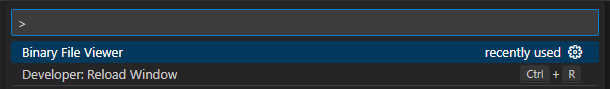
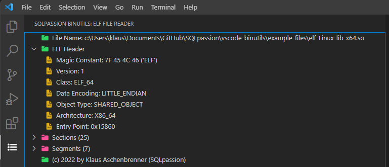

# vscode-binutils README

The purpose of this Visual Studio Code extension is to parse binary files, and show its content in a structured way. 
Currently, the extension only supports `Linux ELF files` with the following CPU architectures:

* `X86_64` (Intel 64-bit)
* `AARCH64` (ARM 64-bit)

## Usage

After the installation of the extension, you can run it with the following command through the Command Palette: `Binary File Viewer`

In the next step the extension shows you a traditional `Open File Dialog`, where you can specify the binary file that you want to open. 

> Note: If you try to open any other binary file as an ELF file, the extension will give you an error message.

After you have selected the binary file, you can explore its content through the `ELF File Viewer` component that you will find within the `Activity Bar` of Visual Studio Code.

## Features
The `vscode-binutils` extension currently parses the following information from `Linux ELF files`:

* ELF Header
* Sections
* Segments
* Symbol Tables
* Relocation Entries
* String Tables

## Extension Settings

The extension has currently no user-defined setttings that you have to worry about.

## For more information

* [SQLpassion Website](https://www.SQLpassion.at)
* [GitHub Repository](https://www.github.com/sqlpassion/vscode-binutils)

**Enjoy!**